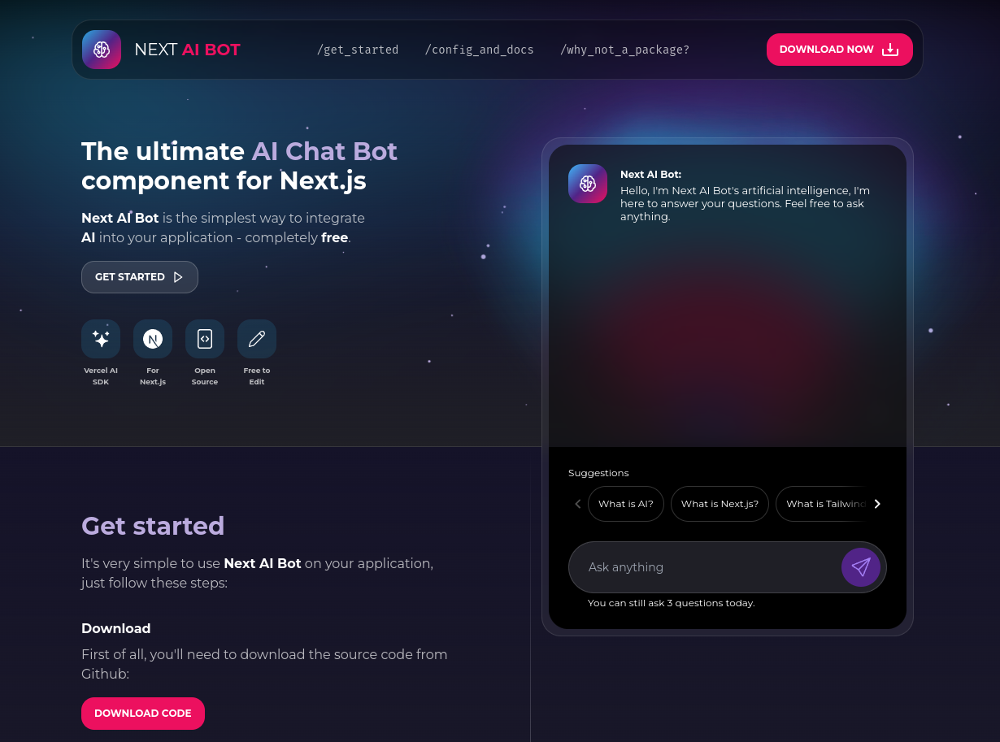

# Next AI Bot

### Next AI Bot is the simplest way to integrate AI into your Next.js application - completely free.

With Next AI Bot, you can add AI to your application in less than 5 minutes.

## Documentation

Docs are available on [Next AI Bot website](https://nextaibot.felipeprado.com.br)

## Requirements

- Next.js 14 or higher.
- Your project should be configured to use Tailwind CSS.
- Your project should be configured to use Typescript
- Your operating system must be able to run shell scripts (.sh). If you are using Windows, I recommend run your project on WSL.

## ☕ Did you like Next AI Bot? You can buy me a coffee.

I hope so. I have worked hard on this, and if you wanna help with any value, I will feel very grateful.
 
 

